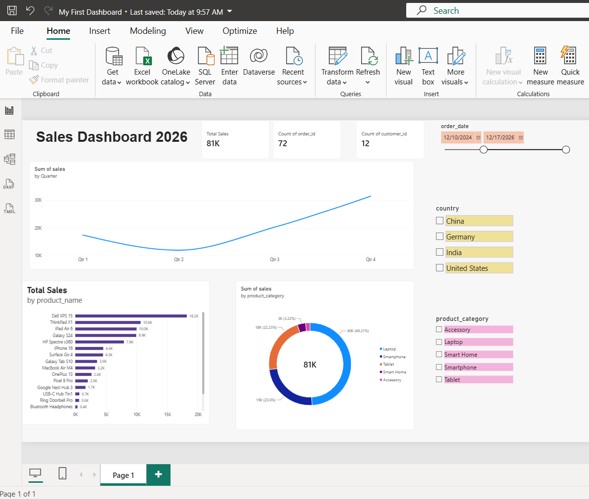

# 📊 Power BI Sales Analytics Dashboard

An interactive Sales Analytics Dashboard built using Power BI to analyze
sales performance, customer activity, product performance, and sales trends.

## 🛠 Technologies Used

- Power BI
- Power Query
- DAX
- Data Modelling
- CSV

## 📊 Dashboard Features

- Total Sales KPI
- Total Orders
- Total Customers
- Average Order Value
- Quarterly Sales Trends
- Sales by Product
- Sales by Product Category
- Country Filtering
- Product Category Filtering
- Date Range Filtering

## 🔄 Data Transformation

Power Query was used to clean and prepare the raw datasets.

Transformations included:

- Promoting headers
- Assigning appropriate data types
- Combining `first_name` and `last_name` into `customer_name`
- Preparing customer and order datasets for analysis

## 🔗 Data Model

The project contains two datasets:

- `customers`
- `orders`

A one-to-many relationship was created using `customer_id`:

customers[customer_id] 1 → * orders[customer_id]

This allows customer attributes such as country and city to filter
corresponding sales and order information.

## 🧮 DAX

DAX was used to create calculated fields and measures.

### Clean Score

    Clean Score = COALESCE(customers[score], 0)

This replaces missing customer score values with 0.

### Total Sales

    Total Sales = SUM(orders[sales])

## 📈 Dashboard Preview

## 📁 Project Files

- `My First Dashboard.pbix` — Power BI project
- `customers.csv` — Customer dataset
- `orders.csv` — Order dataset
- `Image_of_Sales_Dashboard.png` — Dashboard preview

## 👩‍💻 Author

**Chamodi Kavindhya**

Software Engineer | Data & BI Enthusiast

[LinkedIn](https://www.linkedin.com/in/chamodikavindhya/)# power-bi-sales-analytics-dashboard
Power BI Dashboards
